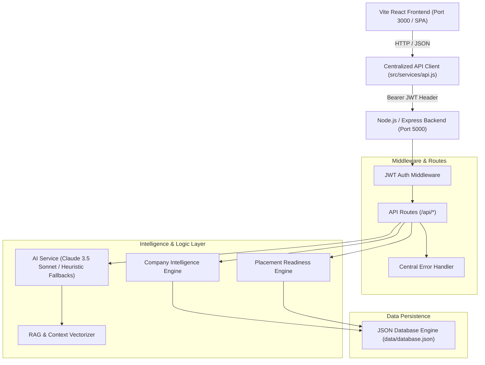

# System Architecture — AI Placement Mentor Agent

The **AI Placement Mentor Agent** is a full-stack, AI-driven placement preparation ecosystem designed to help engineering students bridge skill gaps, practice technical interviews, match with prospective employers, and simulate real placement rounds.

---

## 1. High-Level Architecture Diagram

---

## 2. Component Responsibilities

### Frontend Layer (`frontend/`)
- **Technology Stack**: React 19, Vite, TailwindCSS, Lucide Icons, Recharts.
- **Pages (`src/pages/`)**: Contains full screen views including Dashboard, Resume Upload, Skill Gap Analysis, Mock Interviews, Coding Lab, Placement Blockers, and What-If Simulator.
- **Components (`src/components/`)**: Houses reusable UI widgets including `Sidebar`, `ChatPanel`, `CompanyLogo`, `SystemHealthModal`, and `ErrorBoundary`.
- **Layouts (`src/layouts/`)**: `DashboardLayout` provides global shell structure, sidebar navigation, floating AI mentor modal, and system health status.
- **Services (`src/services/`)**: Centralized HTTP client (`api.js`) with request timeouts, token injection, error extraction, and fallback detection.

### Backend Layer (`backend/`)
- **Technology Stack**: Node.js, Express.js, JWT, Multer, PDF-Parse, Anthropic SDK.
- **Routes (`src/routes/`)**: Modular routers handling Auth, Resumes, Companies, Mock Interviews, Coding Lab, Readiness, Roadmaps, and System Diagnostics.
- **Controllers (`src/controllers/`)**: HTTP handlers validating inputs and formatting JSON API responses.
- **Services (`src/services/`)**: Business logic algorithms:
  - `aiService.js`: Interface to Claude 3.5 Sonnet API with comprehensive fallback heuristics.
  - `companyIntelligenceEngine.js`: Multi-company analytics, tiering, interview patterns, and salary insights.
  - `readinessEngine.js`: Multi-factorial placement readiness index calculation.
- **Middleware (`src/middleware/`)**: JWT validation (`auth.js`) and unified error handler (`errorMiddleware.js`).

### Data Persistence (`backend/data/database.json`)
- High-performance, zero-config JSON document storage supporting 15 placement tables with full ACID-like transactional helper functions (`initDb`, `query`, `insert`, `update`, `remove`).

---

## 3. Security & Authentication Flow

1. **Authentication**: Users register or log in via POST `/api/auth/login` or `/api/auth/signup`.
2. **Token Issuance**: Server verifies credentials with `bcryptjs` and returns a signed JWT token.
3. **Storage & Headers**: Client stores JWT token in `localStorage` and automatically attaches `Authorization: Bearer <token>` header to all outgoing requests.
4. **Protection**: Backend `auth.js` middleware validates token signature before passing control to route handlers.
